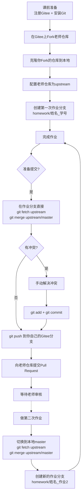

# Gitee教学用示例仓库 - 学生作业提交指南

## 📚 项目简介

这是一个为非计算机专业研究生设计的Gitee教学用示例仓库，包含详细的**多人协作作业提交指南**，专门优化以减少版本冲突。

## 📂 仓库结构

```
├── documents/         # 文档文件夹
├── examples/          # 示例文件文件夹
├── exercises/         # 练习任务文件夹 (你的作业放这里)
├── .gitignore         # Git忽略文件配置
└── README.md          # 本说明文件
```

***

## 🗺️ 一分钟看懂 Git 工作流（极简版）

如果你是完全的新手，请先在脑海中建立这个极简流程：

**步骤概览：**
1. **Fork** 仓库（把老师的代码复制到你的Gitee账号下）
2. **Clone** 仓库（把你的Gitee代码下载到本地电脑）
3. **创建分支**（建立你自己的独立作业空间）
4. **写作业**（在 `exercises/` 文件夹下修改文件）
5. **Commit**（保存你的修改记录）
6. **Push**（把本地作业上传到你的Gitee仓库）
7. **PR** (Pull Request)（请求老师批改并合并你的作业）

**Git 数据流向图：**
```text
老师仓库 (upstream)
       │
       │ 1. Fork (网页端)
       ↓
学生仓库 (origin)
       │
       │ 2. clone (下载到电脑)
       ↓
学生电脑 (本地仓库)
       │
       │ 6. push (推送到云端)
       ↓
学生仓库 (origin)
       │
       │ 7. Pull Request (PR, 网页端)
       ↓
老师仓库 (upstream)
```

***

## 🚀 第一部分：课前准备（必读！）

### 1. Gitee账号注册

**步骤1：访问Gitee官网**

- 打开浏览器，访问 <https://gitee.com>
- 点击右上角的"注册"按钮

**步骤2：填写注册信息**

- 输入你的手机号或邮箱地址
- 创建一个用户名（建议使用真实姓名或易于识别的名称，如：zhang\_san\_2025）
- 设置一个强密码
- 完成验证（输入验证码）

**步骤3：验证账号**

- 如果使用手机号注册，输入收到的短信验证码
- 如果使用邮箱注册，登录邮箱点击验证链接

**步骤4：完善个人信息**

- 填写真实姓名（可选但推荐）
- 选择所在行业和职业
- 完成注册

**✅ 成功标准**：你可以使用用户名和密码登录Gitee。

***

### 2. Git安装指南

#### Windows系统

1. 访问 [Git官网](https://git-scm.com/download/win)
2. 下载最新版本的Git for Windows
3. 运行安装程序，**全程使用默认选项即可**
4. 安装完成后，打开Git Bash（在开始菜单搜索"Git Bash"），输入以下命令验证：
   ```bash
   git --version
   ```

#### macOS系统

1. 打开终端（Terminal）
2. 输入 `xcode-select --install` 安装Command Line Tools
3. 或访问 [Git官网](https://git-scm.com/download/mac) 下载安装包
4. 安装完成后，在终端输入：
   ```bash
   git --version
   ```

#### Linux系统

1. 打开终端
2. 根据你的Linux发行版，输入以下命令：
   - Ubuntu/Debian: `sudo apt install git`
   - CentOS/RHEL: `sudo yum install git`
   - Fedora: `sudo dnf install git`
3. 安装完成后，输入：
   ```bash
   git --version
   ```

**✅ 成功标准**：命令显示Git版本号（如 `git version 2.43.0`）。

***

### 3. 配置Git用户信息（仅需做一次）

打开Git Bash或终端，输入以下两条命令（**替换为你的真实信息**）：

```bash
git config --global user.name "你的姓名"
git config --global user.email "你的邮箱@example.com"
```

**✅ 成功标准**：输入以下命令检查配置：

```bash
git config --global --list
```

你应该能看到刚才设置的姓名和邮箱。

***

## 🌿 第二部分：正确的仓库克隆方法（先Fork，再克隆）

### 第一步：Fork（派生）老师的仓库

1. 访问老师提供的Gitee仓库页面
2. 点击页面右上角的 **"Fork"** 按钮
3. 在弹出的窗口中，选择你自己的Gitee账号作为目标
4. 点击确认，等待Gitee为你创建一个属于你的仓库副本（你会发现仓库名左上角变成了 `你的用户名 / 仓库名称`）

### 第二步：获取你自己的仓库链接

1. 在**你刚刚Fork过来的仓库页面**中
2. 点击右上角的 **"克隆/下载"** 按钮
3. 确保选择 **HTTPS** 选项（对新手更简单）
4. 点击复制图标复制链接

### 第三步：克隆你的专属仓库到本地

1. 在电脑上选择一个合适的文件夹存放作业（比如桌面的 `Homework` 文件夹）
2. 右键点击该文件夹，选择 **"Git Bash Here"**（Windows）或打开终端进入该目录
3. 执行克隆命令（**注意：这里的链接是你自己的仓库，不是老师的！**）：

   ```bash
   git clone https://gitee.com/你的用户名/仓库名称.git
   ```

   **示例**：

   ```bash
   git clone https://gitee.com/zhang_san_2025/ai-tool-course-homework-2026.git
   ```

4. 进入仓库目录：

   ```bash
   cd 仓库名称
   ```

   **示例**：
   ```bash
   cd ai-tool-course-homework-2026
   ```

### 第四步：配置老师的仓库作为“上游”（Upstream）

**这是非常关键的一步！** 你需要告诉 Git 老师的仓库在哪里，这样以后才能拉取老师发布的新作业。

1. 在你的仓库目录中（Git Bash 里），执行以下命令添加老师的仓库：

   ```bash
   git remote add upstream https://gitee.com/老师的用户名/仓库名称.git
   ```

   **示例**：
   ```bash
   git remote add upstream https://gitee.com/teacher/ai-tool-course-homework-2026.git
   ```

2. 验证是否添加成功：
   ```bash
   git remote -v
   ```
   **✅ 成功标准**：你应该能看到 `origin` 指向你自己的仓库，同时 `upstream` 指向老师的仓库。

**✅ 克隆完成标准**：
- 你可以在本地文件夹中看到与Gitee上相同的文件
- 输入 `ls`（或 `dir`）命令能看到 `documents/`、`examples/` 等文件夹

***

## 🌳 第三部分：创建个人作业分支（标准化流程）

### ⚠️ 重要！永远不要直接在本地的 master 分支上执行 add 或 commit 操作！

### 创建个人分支的步骤：

1. **确保你在 master 分支上**：
   ```bash
   git checkout master
   ```
2. **确保你的 master 分支是最新的**：
   *(如果你刚刚克隆，这一步可以跳过。如果是之后再次做作业，请先执行以下命令)*
   ```bash
   git fetch upstream
   git merge upstream/master
   ```
3. **创建并切换到你的个人分支**（**强烈建议使用学号_拼音命名，避免中文编码问题**）：
   ```bash
   git checkout -b homework/你的学号_拼音姓名
   ```

   **示例**：
   ```bash
   git checkout -b homework/2023001_zhangsan
   ```

4. **确认你在正确的分支上**：
   ```bash
   git branch
   ```

**✅ 成功标准**：
- 命令行显示当前分支为 `homework/2023001_zhangsan`（有 `*` 标记）
- 你现在可以安全地修改文件了！

***

## 📝 第四部分：完成作业与提交前的同步（强制步骤！）

### 场景一：你正在写作业，还没有提交过

**步骤1：保存你的所有文件修改**

**步骤2：查看当前状态**

```bash
git status
```

**步骤3：添加你的作业文件到暂存区**
```bash
git add exercises/你的作业文件名
```
（⚠️ **强烈建议**：只添加你修改的文件，**不要**使用 `git add .`，以免不小心把 `.idea`、`.vscode` 等无关的缓存文件提交上去）

**示例**：
   ```bash
   git add exercises/student_info_2023001_zhangsan.txt
   ```

**步骤4：提交修改（写清楚提交信息）**
```bash
git commit -m "完成作业1：2023001_zhangsan"
```

***

### 场景二：准备推送前，必须同步老师的最新内容（关键！）

**这是防止冲突的最重要步骤！**

**步骤0：确保你当前分支的修改已经全部 Commit（即执行完场景一的步骤）。**

**步骤1：将老师的最新内容拉取并合并到你的作业分支**
回到你的Git命令行，**保持在你当前的作业分支上**，执行：
```bash
git fetch upstream
git merge upstream/master  # 如果老师的默认分支是 main，请改为 git merge upstream/main
```
*(💡 **解释**：第一行命令是从老师的仓库下载最新代码到你的电脑；第二行命令是将下载下来的老师代码（`master` 或 `main` 分支）合并到你当前的作业分支中。)*

***

### 如果合并时出现冲突怎么办？（冲突解决指南）

#### 什么是冲突？
冲突发生在：你修改了某个文件，而老师在原仓库中也更新了该文件的同一位置，当你要合并老师的最新更新时就会产生冲突。

#### 冲突长什么样？
Git会在冲突文件中标记出冲突的部分：

```text
<<<<<<< HEAD
这是你写的内容
=======
这是老师在原仓库写的内容
>>>>>>> master
```

#### 解决冲突的步骤：

1. **打开有冲突的文件**（用记事本或任何文本编辑器）
2. **决定保留哪些内容**：
   - 删除 `<<<<<<< HEAD`、`=======`、`>>>>>>> master` 这些标记行
   - 保留你想要的内容（可以只保留你的、只保留别人的，或者合并两者）
3. **保存文件**
4. **告诉Git冲突已解决**：
   ```bash
   git add 冲突的文件名
   ```
5. **完成合并**：
   ```bash
   git commit -m "解决合并冲突"
   ```

**✅ 成功标准**：

- 输入 `git status` 显示没有未解决的冲突
- 所有文件都显示为已提交状态

***

## 🚀 第五部分：提交作业的标准化操作流程

### 完整提交流程：

1. **确保你在自己的分支上**：
   ```bash
   git branch
   ```
   （应该显示 `* homework/你的学号_拼音姓名`）

2. **确保所有修改都已提交**：
   ```bash
   git status
   ```
   （应该显示 "nothing to commit, working tree clean"）

3. **推送到你自己的Gitee仓库**：
   ```bash
   git push origin homework/你的学号_拼音姓名
   ```

   **示例**：
   ```bash
   git push origin homework/2023001_zhangsan
   ```

4. **在Gitee上向老师提交 Pull Request（PR）**：
   - 访问**你自己的**Gitee仓库页面
   - 你会看到一个提示："你最近推送了分支 homework/xxx"，点击"创建 Pull Request"
   - **确保合并方向是：**
     - **源分支 (Head)**：你的用户名 : `homework/xxx`
     - **目标分支 (Base)**：老师的仓库 : `master`
   - 填写PR标题：`[作业提交] zhangsan_2023001`
   - **在描述中请使用以下规范格式**，方便老师批改：
     ```text
     姓名：张三
     学号：2023001
     作业内容：完成 exercises/task1
     ```
   - 点击 "创建" 按钮

**✅ 成功标准**：
- 在老师的Gitee仓库中能看到你提交的 Pull Request
- 老师会收到通知并审核你的作业

---

### 👨‍🏫 附：老师端的审核流程（你交完作业后会发生什么？）

当你提交 PR 后，老师会进行以下操作：
1. **查看 Pull Request**：在老师的仓库后台看到你的提交请求。
2. **Review (代码审查)**：老师会查看你具体修改了哪些代码/文件。
3. **Comment (点评)**：老师可能会在你的代码某一行直接留下修改建议。
4. **Merge (合并)**：如果作业合格，老师会点击 Merge，你的代码就会正式成为主仓库的一部分，作业批改完成！

---***

## 🔄 第六部分：后续作业提交流程（更新你的分支）

当你需要做第二次作业时：

1. **切换到本地 master 分支**（如果你的默认分支叫 `main`，请将下面所有的 `master` 替换为 `main`）：
   ```bash
   git checkout master
   ```

2. **拉取老师的最新作业内容到本地**：
   ```bash
   git fetch upstream
   git merge upstream/master
   ```

3. **同步更新你自己的 Gitee 远程仓库**（重要，保持两边一致）：
   ```bash
   git push origin master
   ```

4. **创建新的作业分支**：
   ```bash
   git checkout -b homework/你的学号_作业2
   ```

5. **开始做作业！**

***

## 🎨 第七部分：创建个人网页教程（GitHub Pages）

*注意：由于 Gitee Pages 目前需要严格的实名认证（如手持身份证等），对交作业来说门槛过高，因此此部分我们将使用国际最大的开源平台 GitHub。你需要先访问 [https://github.com](https://github.com) 注册一个新账号。*

GitHub Pages 是GitHub提供的免费静态网页托管服务，你可以用它来创建个人博客、项目展示页面等。

### 第一步：创建专门的仓库

1. 登录GitHub，点击右上角的 "+" 号，选择"New repository"
2. 仓库名称**必须**是：`你的用户名.github.io`
   - 例如：如果你的GitHub用户名是 `zhangsan`，仓库名就叫 `zhangsan.github.io`
3. 选择"Public"
4. 勾选"Initialize this repository with a README"
5. 点击"Create repository"

**✅ 成功标准**：你有了一个名为 `你的用户名.github.io` 的仓库。

***

### 第二步：创建第一个网页

1. 进入你的 `你的用户名.github.io` 仓库
2. 点击 "Add file" → "Create new file"
3. 文件名输入：`index.html`（这是主页）
4. 在文件内容中输入以下代码：

   ```html
   <!DOCTYPE html>
   <html>
   <head>
       <meta charset="UTF-8">
       <title>我的个人网页</title>
       <style>
           body {
               font-family: "Microsoft YaHei", sans-serif;
               max-width: 800px;
               margin: 0 auto;
               padding: 20px;
               background-color: #f5f5f5;
           }
           .header {
               text-align: center;
               background-color: #24292e;
               color: white;
               padding: 20px;
               border-radius: 10px;
           }
           .content {
               background-color: white;
               padding: 20px;
               margin-top: 20px;
               border-radius: 10px;
               box-shadow: 0 2px 5px rgba(0,0,0,0.1);
           }
           .footer {
               text-align: center;
               margin-top: 20px;
               color: #666;
           }
       </style>
   </head>
   <body>
       <div class="header">
           <h1>欢迎来到我的个人网页！</h1>
           <p>这是我用GitHub Pages创建的第一个网页</p>
       </div>
       
       <div class="content">
           <h2>关于我</h2>
           <p>大家好，我是【你的姓名】，一名【你的专业】学生。</p>
           
           <h2>我的兴趣</h2>
           <ul>
               <li>人工智能</li>
               <li>编程开发</li>
               <li>阅读写作</li>
           </ul>
           
           <h2>联系方式</h2>
           <p>邮箱：你的邮箱@example.com</p>
       </div>
       
       <div class="footer">
           <p>&copy; 2026 我的个人网页 | Powered by GitHub Pages</p>
       </div>
   </body>
   </html>
   ```

5. 在页面底部填写提交信息，点击"Commit new file"按钮

***

### 第三步：开启GitHub Pages服务

1. 在你的仓库页面，点击顶部的 "Settings" 选项卡
2. 在左侧菜单中找到并点击 "Pages"
3. 在 "Source" 部分，选择 "Deploy from a branch"
4. 在 "Branch" 下拉菜单中选择 `main`，文件夹选择 `/ (root)`
5. 点击 "Save"

**✅ 成功标准**：页面显示"Your site is live at https://你的用户名.github.io"。

***

### 第四步：访问你的个人网页

等待几分钟后（首次部署可能需要5-10分钟），你就可以通过以下地址访问你的网页了：

```
https://你的用户名.github.io
```

**示例**：

```
https://zhangsan.github.io
```

***

### 进阶：如何更新你的网页

#### 方法一：在GitHub网页上直接编辑

1. 进入你的仓库
2. 点击要修改的文件（如 `index.html`）
3. 点击编辑图标（铅笔形状）
4. 修改内容
5. 在页面底部填写提交信息，点击"Commit changes"

#### 方法二：使用Git在本地编辑（推荐）

1. **克隆仓库到本地**：
   ```bash
   git clone https://github.com/你的用户名/你的用户名.github.io.git
   ```
2. **进入仓库目录**：
   ```bash
   cd 你的用户名.github.io
   ```
3. **修改文件**（用任何文本编辑器）
4. **提交并推送**：
   ```bash
   git add index.html
   git commit -m "更新网页内容"
   git push origin main
   ```

***

### 更多创意玩法

1. **添加图片**：
   - 在仓库中创建一个 `images` 文件夹
   - 上传图片到该文件夹
   - 在HTML中引用：``
2. **创建多个页面**：
   - 创建 `about.html`（关于我）
   - 创建 `blog.html`（博客）
   - 在主页添加导航链接
3. **使用模板**：
   - 在GitHub上搜索 "HTML5 template" 或 "static website template"
   - 下载喜欢的模板
   - 上传到你的GitHub Pages仓库

***

### GitHub Pages 常见问题

**Q: 我的网页访问显示404怎么办？**
A: 请确保：

- 仓库名正确（必须是 `你的用户名.github.io`）
- 已经开启了GitHub Pages服务
- 等待5-10分钟让服务生效（首次部署需要时间）

**Q: 可以绑定自定义域名吗？**
A: 可以！在GitHub Pages设置页面可以添加自定义域名。

**Q: 网页更新后多久能看到变化？**
A: 通常几分钟内就会更新，有时需要清除浏览器缓存才能看到最新内容。

***

## ⚠️ 第八部分：关键注意事项和最佳实践

### ✅ 一定要做的：

1. **永远使用个人分支**：不要直接在 master 分支上修改
2. **每次提交前先同步**：`git fetch upstream` + `git merge upstream/master` 是你的好朋友
3. **小步提交**：完成一部分就提交一次，不要等全部写完
4. **写清楚提交信息**：让老师和未来的你知道这次提交做了什么
5. **每次只修改属于你的文件**：创建带有你学号拼音的文件，比如 `student_info_2023001_zhangsan.txt`

### ❌ 千万不要做的：

1. **不要修改别人的文件**
2. **不要在还没同步的情况下强行推送**（`git push -f` 是危险命令！）
3. **不要删除.git文件夹**（这会让Git失忆！）
4. **不要同时在多台电脑上修改同一个分支而不同步**

***

## 📊 作业提交流程图



***

## 🔧 第九部分：常见概念与问题排查

### 💡 核心概念问答（新手必看）

**Q：为什么要 Fork，而不是直接 Clone 老师的仓库？**
A：因为你没有权限直接修改老师的仓库。Fork 相当于在云端把老师的代码完整复制一份到你的账号下，这样你就有了一个完全属于自己的、可以随意修改的独立仓库。

**Q：为什么不能直接在本地的 master 分支上写作业？**
A：`master` 分支的作用是用来和老师的最新代码保持同步的基准线。如果你在 `master` 上写作业，当老师发布新内容你拉取更新时，就非常容易发生代码冲突。养成每次写作业都新建分支的习惯，是多人协作的最佳实践。

**Q：PR (Pull Request) 到底是什么？**
A：Pull Request 字面意思是“拉取请求”。当你完成了作业并 Push 到你自己的仓库后，你需要通过 PR 请求老师把你的代码“拉取并合并”到主仓库中，这就是交作业的过程。

---

### 问题1：我忘记创建分支，直接在 master 上修改了怎么办？

**最简单安全的解决方法（推荐新手）**：
把当前你修改好的文件先复制到桌面备份，然后把整个仓库文件夹删除，重新 clone 一遍，按标准流程创建分支后，再把你备份的文件覆盖进去。

**进阶解决方法（使用 Git 暂存功能）**：
```bash
# 1. 暂存你的修改
git stash

# 2. 切换到 master 并拉取老师的最新内容
git checkout master
git fetch upstream
git merge upstream/master

# 3. 创建你的个人分支
git checkout -b homework/你的学号_拼音姓名

# 4. 恢复你的修改
git stash pop

# 5. 继续正常提交
```

***

### 问题2：推送时提示 "failed to push some refs"

**原因**：你的本地分支落后于远程分支

**解决方法**：

```bash
# 1. 先拉取最新内容
git pull origin homework/你的姓名_你的学号

# 2. 如果有冲突，解决冲突

# 3. 再推送
git push origin homework/你的姓名_你的学号
```

***

### 问题3：我想撤销刚才的提交怎么办？

**解决方法**（只是撤销提交，保留文件修改）：

```bash
git reset --soft HEAD~1
```

***

### 问题4：Git命令行太复杂，有没有图形界面工具？

**推荐工具**：

- **Gitee Desktop**（Gitee官方客户端）
- **SourceTree**：<https://www.sourcetreeapp.com/>
- **VS Code**：内置Git支持

***

### 问题5：GitHub Pages网页无法访问？

**检查清单**：
1. 仓库名是否正确：`你的用户名.github.io`
2. 是否已开启GitHub Pages服务
3. 是否有 `index.html` 文件
4. 等待5-10分钟让服务生效（首次部署可能需要时间）

***

## 📚 第十部分：扩展学习资源

- [Gitee官方文档](https://gitee.com/help)（中文）
- [GitHub Pages 使用指南](https://docs.github.com/zh/pages)
- [Git官方教程](https://git-scm.com/doc)
- [廖雪峰Git教程](https://www.liaoxuefeng.com/wiki/896043488029600)（中文，推荐新手）
- [Git可视化学习](https://learngitbranching.js.org/)（交互式游戏）
- [HTML/CSS入门教程](https://www.runoob.com/html/html-tutorial.html)（菜鸟教程）

***

## ✅ 第十一部分：学习成果验证清单

- [ ] 成功注册Gitee账号
- [ ] 正确安装Git并验证版本
- [ ] 成功在Gitee上Fork老师的仓库
- [ ] 成功克隆自己Fork的仓库到本地
- [ ] 能够创建自己的个人分支
- [ ] 成功配置了老师的仓库作为 upstream
- [ ] 理解提交前同步的重要性（使用 `git fetch upstream` 和 `git merge upstream/master`）
- [ ] 知道如何解决简单的合并冲突
- [ ] 成功推送分支到自己的Gitee仓库
- [ ] 成功向老师仓库提交Pull Request
- [ ] 能够独立完成一次作业提交
- [ ] 创建了自己的GitHub Pages个人网页

***

## 💡 第十二部分：给新手的建议

1. **慢慢来**：Git的概念需要时间理解，不要着急
2. **多练习**：按照指南多操作几次，就会熟悉
3. **不要怕出错**：Git有很多撤销功能，大部分错误都能挽回
4. **问老师和同学**：遇到问题及时求助
5. **保存好你的Gitee账号密码**：或者使用SSH密钥更安全
6. **尝试创建个人网页**：这是展示你学习成果的好方式！

***

## 📞 获取帮助

如果在操作过程中遇到问题：

1. 先查看本指南的"常见问题故障排除"部分
2. 询问身边的同学
3. 在课程群里提问
4. 联系老师

***

祝大家学习愉快！🚀
